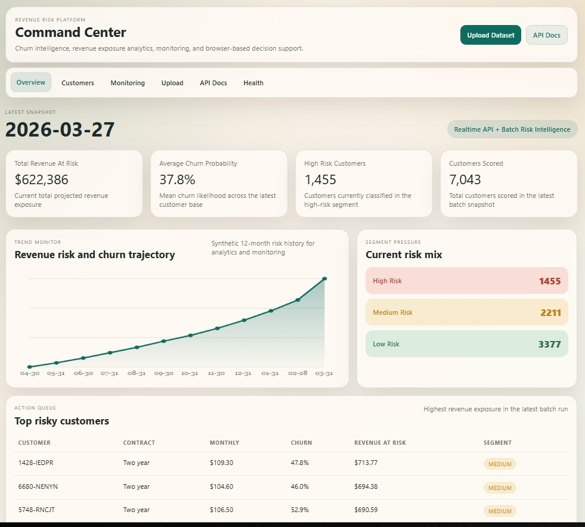
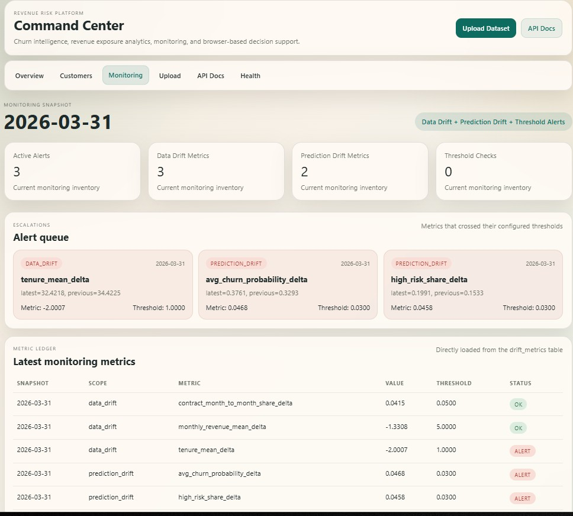
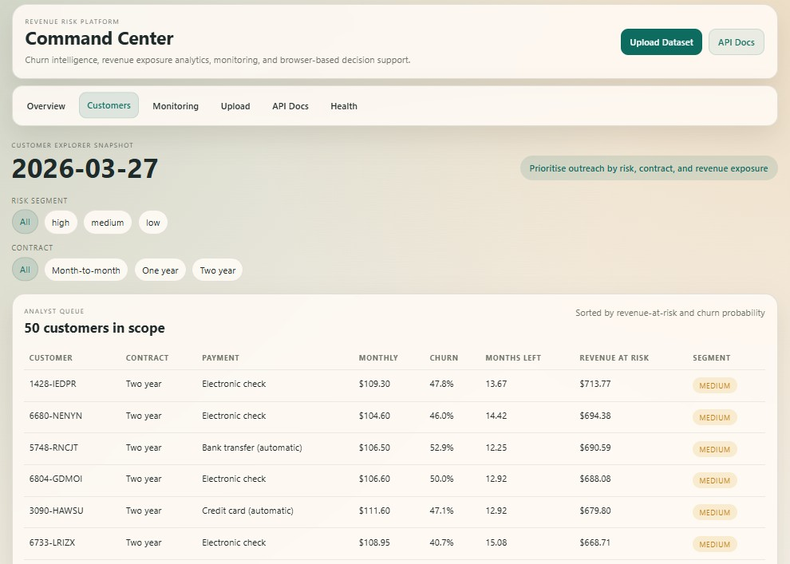
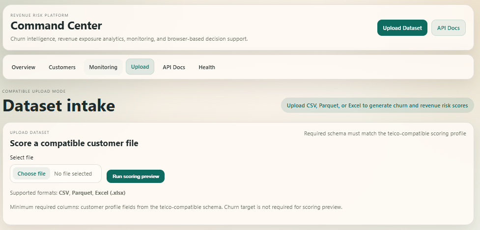
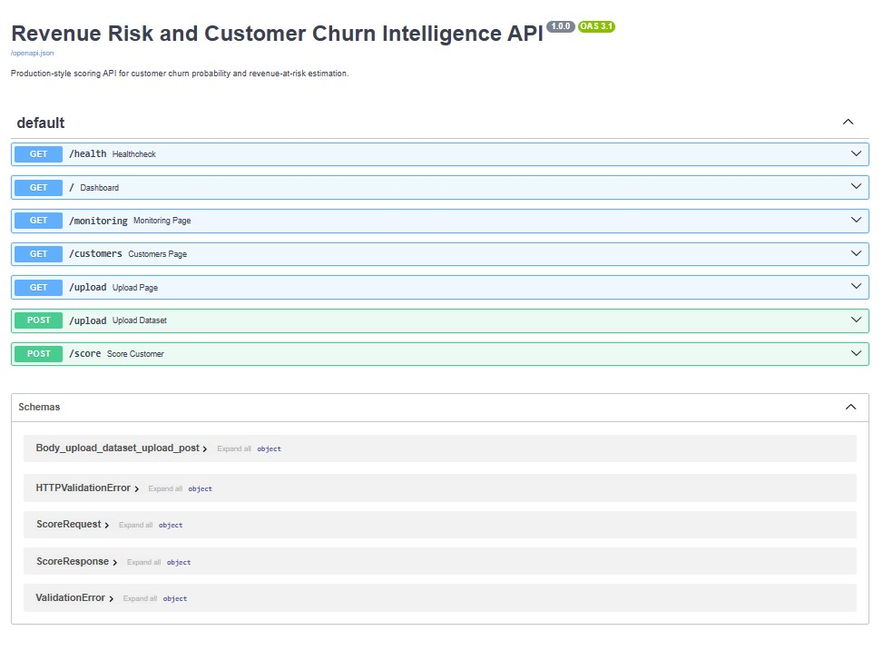

# Revenue Risk and Customer Churn Intelligence Platform

Production-style churn intelligence application built with Python, FastAPI, PostgreSQL, and browser-based analytics pages.

This project scores customer churn risk, estimates revenue exposure, tracks drift and threshold alerts, exposes a realtime scoring API, and delivers a browser experience for risk operations and business review.

## Recruiter Snapshot
- Business use case: churn detection, revenue-at-risk estimation, and customer retention prioritisation
- End-to-end flow: `ingest -> validate -> features -> train -> batch scoring -> realtime API -> PostgreSQL mart -> monitoring -> browser UI`
- Includes: batch scoring, realtime scoring API, temporal snapshot generation, PostgreSQL risk mart, drift monitoring, threshold alerts, browser dashboard, customer explorer, and compatible dataset upload preview
- Built with: Python, pandas, scikit-learn, FastAPI, SQLAlchemy, PostgreSQL, Jinja2

## Product Goal
Build a business-facing churn intelligence platform that:
- predicts `churn_probability`
- estimates `revenue_at_risk`
- segments customers into `low`, `medium`, and `high` risk
- exposes a realtime scoring endpoint
- writes batch outputs into a PostgreSQL analytics layer
- monitors drift and alert thresholds
- supports browser-based risk review and compatible dataset uploads

## Architecture
Pipeline flow:

`Raw Data -> Validation -> Feature Engineering -> Model Training -> Batch Scoring -> Temporal Snapshots -> PostgreSQL Risk Mart -> Monitoring -> Browser UI / API`

Main layers:
- `ingest`: download, validate, parquet conversion, temporal snapshot generation
- `features`: engineered churn and revenue-risk features
- `train`: model training, benchmarking, metrics, artifacts
- `batch`: daily scoring snapshot creation
- `api`: FastAPI scoring API and browser UI routes
- `db`: PostgreSQL schema and data loading scripts
- `monitoring`: data drift, prediction drift, threshold alerts
- `ui`: dashboard, monitoring page, customer explorer, dataset upload preview

## Core Features
- Public telco churn dataset ingestion and validation
- Feature engineering for tenure, contract, payment, and service risk signals
- Benchmark model training with Logistic Regression and Random Forest
- Saved model and preprocessor artifacts using `joblib`
- Batch snapshot generation with `churn_probability`, `expected_months_remaining`, and `revenue_at_risk`
- Realtime scoring API: `POST /score`
- Temporal customer snapshots for 12-month trend analysis
- PostgreSQL mart with `customers_raw`, `features`, `scores_daily`, `customer_snapshots`, `drift_metrics`, and `model_registry`
- Drift monitoring and threshold alert pipelines
- Browser pages:
  - `/`
  - `/monitoring`
  - `/customers`
  - `/upload`

## Data Source
- Source file: `Telco-Customer-Churn.csv`
- Source URL: [IBM Telco Customer Churn dataset](https://raw.githubusercontent.com/IBM/telco-customer-churn-on-icp4d/master/data/Telco-Customer-Churn.csv)

## Model Summary
- Baseline: Logistic Regression
- Benchmark winner: Random Forest
- Selected model AUC: `0.8420`
- Selected model precision: `0.5402`
- Selected model recall: `0.7540`
- Selected model F1: `0.6295`

Metrics source: [`reports/train_metrics.json`](reports/train_metrics.json)

## Current Business Outputs
- Latest total revenue at risk: `$622,385.88`
- Average churn probability: `37.8%`
- High-risk customers: `1,455`
- Top current revenue-at-risk customers:
  - `1428-IEDPR` -> `$713.77`
  - `6680-NENYN` -> `$694.38`
  - `5748-RNCJT` -> `$690.59`
- Temporal history range: `2025-04-30` to `2026-03-31`

## Browser App
Main browser pages:
- `/` - executive risk overview with KPI cards, trend chart, segment mix, and top risky customers
- `/monitoring` - drift and threshold alert review
- `/customers` - analyst queue with filters by risk segment and contract
- `/upload` - compatible dataset upload and scoring preview

Detailed business summary: [`reports/REPORT.md`](reports/REPORT.md)

## Screenshots
### Executive Dashboard


The home page gives a business-facing view of current revenue exposure, churn pressure, segment distribution, and the highest-priority risky customers in the latest batch run.

### Monitoring Center


The monitoring page surfaces data drift, prediction drift, and threshold alerts in a format that is easy to review during model operations and risk checks.

### Customer Explorer


The customer explorer helps analysts filter the latest customer population by risk segment and contract profile, then sort action priorities by projected revenue at risk.

### Dataset Upload Preview


The upload page accepts compatible CSV, Parquet, and Excel files, validates the schema, and produces an in-memory scoring preview without overwriting the core production snapshot.

### Realtime API Documentation


Swagger documentation exposes the realtime scoring contract and makes it easy to test the `POST /score` endpoint directly from the browser.

## API
- `GET /health`
- `POST /score`
- Swagger docs: `/docs`

Example `POST /score` payload:

```json
{
  "customerID": "7590-VHVEG",
  "gender": "Female",
  "SeniorCitizen": 0,
  "Partner": "Yes",
  "Dependents": "No",
  "tenure": 1,
  "PhoneService": "No",
  "MultipleLines": "No phone service",
  "InternetService": "DSL",
  "OnlineSecurity": "No",
  "OnlineBackup": "Yes",
  "DeviceProtection": "No",
  "TechSupport": "No",
  "StreamingTV": "No",
  "StreamingMovies": "No",
  "Contract": "Month-to-month",
  "PaperlessBilling": "Yes",
  "PaymentMethod": "Electronic check",
  "MonthlyCharges": 29.85,
  "TotalCharges": 29.85
}
```

Example response:

```json
{
  "customer_id": "7590-VHVEG",
  "churn_probability": 0.697612,
  "monthly_revenue": 29.85,
  "expected_months_remaining": 2.92,
  "revenue_at_risk": 60.81,
  "risk_segment": "medium"
}
```

## Local Setup
1. `python -m venv .venv`
2. `.\.venv\Scripts\Activate.ps1`
3. `pip install -r requirements.txt`
4. Create PostgreSQL database `churn_risk`
5. Update `.env` with the correct PostgreSQL password and port

## End-to-End Run Order
1. Download raw data

```powershell
$env:PYTHONPATH='src'; .\.venv\Scripts\python -m churn_risk.ingest.download_data
```

2. Validate raw data

```powershell
$env:PYTHONPATH='src'; .\.venv\Scripts\python -m churn_risk.ingest.validate_data
```

3. Convert raw CSV to parquet

```powershell
$env:PYTHONPATH='src'; .\.venv\Scripts\python -m churn_risk.ingest.raw_to_parquet
```

4. Build features

```powershell
$env:PYTHONPATH='src'; .\.venv\Scripts\python -m churn_risk.features.build_features
```

5. Train the model

```powershell
$env:PYTHONPATH='src'; .\.venv\Scripts\python -m churn_risk.train.train_model
```

6. Run batch scoring

```powershell
$env:PYTHONPATH='src'; .\.venv\Scripts\python -m churn_risk.batch.score_batch
```

7. Generate temporal snapshots

```powershell
$env:PYTHONPATH='src'; .\.venv\Scripts\python -m churn_risk.ingest.generate_temporal_dataset
```

8. Initialize database and load marts

```powershell
$env:PYTHONPATH='src'; .\.venv\Scripts\python -m churn_risk.db.init_db
$env:PYTHONPATH='src'; .\.venv\Scripts\python -m churn_risk.db.load_raw_to_db
$env:PYTHONPATH='src'; .\.venv\Scripts\python -m churn_risk.db.load_features_to_db
$env:PYTHONPATH='src'; .\.venv\Scripts\python -m churn_risk.db.load_scores_to_db
$env:PYTHONPATH='src'; .\.venv\Scripts\python -m churn_risk.db.load_snapshots_to_db
```

9. Run monitoring

```powershell
$env:PYTHONPATH='src'; .\.venv\Scripts\python -m churn_risk.monitoring.data_drift
$env:PYTHONPATH='src'; .\.venv\Scripts\python -m churn_risk.monitoring.prediction_drift
$env:PYTHONPATH='src'; .\.venv\Scripts\python -m churn_risk.monitoring.threshold_alerts
```

10. Start the browser app and API

```powershell
$env:PYTHONPATH='src'; .\.venv\Scripts\uvicorn churn_risk.api.app:app --host 127.0.0.1 --port 8010 --reload
```

Open:
- `http://127.0.0.1:8010/`
- `http://127.0.0.1:8010/monitoring`
- `http://127.0.0.1:8010/customers`
- `http://127.0.0.1:8010/upload`
- `http://127.0.0.1:8010/docs`

## Dataset Upload Mode
The browser app already supports a `compatible upload mode`:
- upload `CSV`, `Parquet`, or `Excel`
- validate required telco-compatible columns
- run scoring preview in-memory
- show KPI summary and top risky uploaded customers

Current scope:
- supports datasets compatible with the project schema
- does not overwrite the core production snapshot automatically

Planned next:
- schema mapping for alternative dataset column names
- upload persistence and run history
- model registry integration for alternate scoring profiles

## Monitoring
Implemented monitoring pipelines:
- data drift
  - `monthly_revenue_mean_delta`
  - `tenure_mean_delta`
  - `contract_month_to_month_share_delta`
- prediction drift
  - `avg_churn_probability_delta`
  - `high_risk_share_delta`
- threshold alerts
  - `total_revenue_at_risk`
  - `avg_churn_probability`

All metrics are stored in PostgreSQL `drift_metrics`.

## Testing
Run tests:

```powershell
$env:PYTHONPATH='src'; .\.venv\Scripts\pytest tests -q
```

Current test coverage:
- feature engineering unit test
- realtime `/score` API test
- batch scoring smoke test

## Why This Project Stands Out
- Moves beyond a simple churn notebook into a production-style risk application
- Ties model output to business value through `revenue_at_risk`
- Includes both API scoring and browser-based risk review
- Adds temporal snapshots for monitoring and trend analytics
- Supports compatible dataset upload instead of hard-locking the app to one demo flow

## Repository Guide
- `src/churn_risk/ingest` - raw data download, validation, parquet conversion, temporal snapshot generation
- `src/churn_risk/features` - feature engineering pipeline
- `src/churn_risk/train` - training, retraining, and artifacts
- `src/churn_risk/batch` - batch scoring outputs
- `src/churn_risk/api` - FastAPI routes for API and browser UI
- `src/churn_risk/db` - PostgreSQL schema, loaders, and model registry
- `src/churn_risk/monitoring` - drift and threshold monitoring jobs
- `src/churn_risk/ui` - templates, dashboard services, and static assets
- `assets/screenshots` - README screenshots
- `reports` - training metrics and business-facing report
